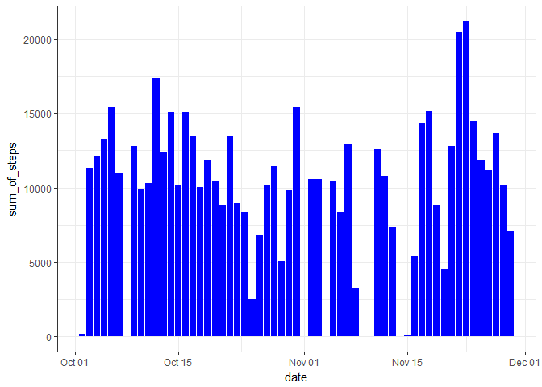
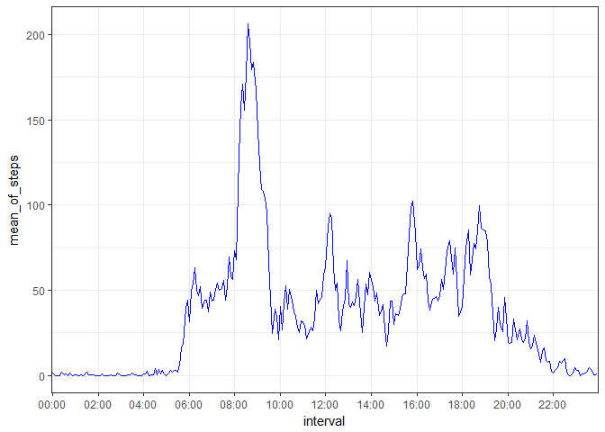
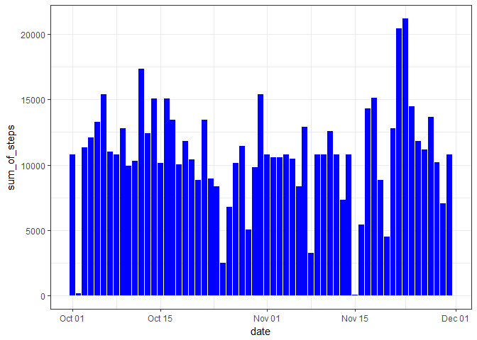
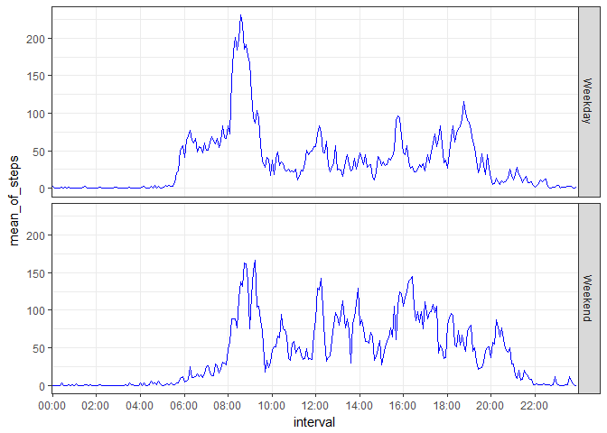

## Loading and preprocessing the data

Downloading the file and unzipping the same before loading into a table: monitering_devices


```r
knitr::opts_chunk$set(message = FALSE,echo = TRUE)
download.file("https://d396qusza40orc.cloudfront.net/repdata%2Fdata%2Factivity.zip",destfile = "zipped_file")
zipped_file<-unzip("zipped_file",exdir="unzipped_data")
setwd("unzipped_data")
monitering_devices<-read.csv("activity.csv")
```


## What is mean total number of steps taken per day?

Getting the number of steps taken per day in a different table  


```r
library(dplyr)
by_date_steps<- monitering_devices %>%
  filter(!is.na(steps)) %>%
  group_by(date) %>%
  summarize(sum_of_steps=sum(steps))
by_date_steps$date<-as.Date(by_date_steps$date,origin="1970-01-01")
```
###Stats of steps by date

-Mean of number of steps taken per day is 1.0766189\times 10^{4}  
-Median of numer of steps taken per day is 10765

###Plotting steps by date


```r
library(ggplot2)
ggplot(by_date_steps, aes(x=date,y = sum_of_steps)) +geom_bar(stat = "identity",fill="blue")+theme_bw()
```

<!-- -->


## What is the average daily activity pattern?
Getting the number of steps taken per interval in a different table 

```r
by_interval_steps<- monitering_devices %>%
  filter(!is.na(steps)) %>%
  group_by(interval) %>%
  summarize(mean_of_steps=mean(steps))
by_interval_steps<-as.data.frame(by_interval_steps)
```

Cleaning Interval values to get them into hh:mm formats

```r
for (i in (1:nrow(by_interval_steps)))
{by_interval_steps[i,"interval"]<-paste(paste(rep("0",times=(4-nchar(by_interval_steps[i,"interval"]))),collapse=""),
                                    as.character(by_interval_steps[i,"interval"]),sep ="",collapse ="")
  }


for (i in (1:nrow(by_interval_steps)))
{by_interval_steps[i,"interval"]<-paste(substr(by_interval_steps[i,"interval"],1,2),":",substr(by_interval_steps[i,"interval"],3,4),sep="",collapse ="")
}
```

###Time series plot of average of steps taken 

```r
hours_labels<-(seq(1,nrow(by_interval_steps),24))
df<-data.frame(hours_labels=character(),stringsAsFactors=FALSE)
for (i in 1:length(hours_labels)) 
{
  df[i,"hours_labels"]<-(by_interval_steps[hours_labels[i],"interval"])
  }

avector <- as.vector(df[,'hours_labels'])

ggplot(by_interval_steps, aes(x=interval,y = mean_of_steps,group=1)) +geom_line(stat = "identity",color="blue")+theme_bw()+
  scale_x_discrete(breaks=avector,labels=avector,expand = waiver())
```

<!-- -->


####Five minute interval that has the maximum no of steps is 08:35

## Imputing missing values

Dividing data set into missing and non missing value

```r
non_null_data<- monitering_devices %>%
  filter(!is.na(steps))
null_data<- monitering_devices %>%
  filter(is.na(steps))
```

Handling missing values by alloting them the average of steps we got in step3

```r
for (i in (1:nrow(null_data)))
{null_data[i,"interval"]<-paste(paste(rep("0",times=(4-nchar(null_data[i,"interval"]))),collapse=""),
                                        as.character(null_data[i,"interval"]),sep ="",collapse ="")
}


for (i in (1:nrow(null_data)))
{null_data[i,"interval"]<-paste(substr(null_data[i,"interval"],1,2),":",substr(null_data[i,"interval"],3,4),sep="",collapse ="")
}

null_data[] <- lapply(null_data, as.character)

null_data_transformed<-merge(null_data[,c(2,3)],by_interval_steps,by.x="interval",by.y="interval")
null_data_transformed[,c(1,2,3)]<-null_data_transformed[,c(3,2,1)]

names(null_data_transformed)<-names(non_null_data)
```

Getting the interval column in Non missing data to be in hh:mm format


```r
for (i in (1:nrow(non_null_data)))
{non_null_data[i,"interval"]<-paste(paste(rep("0",times=(4-nchar(non_null_data[i,"interval"]))),collapse=""),
                                as.character(non_null_data[i,"interval"]),sep ="",collapse ="")
}


for (i in (1:nrow(non_null_data)))
{non_null_data[i,"interval"]<-paste(substr(non_null_data[i,"interval"],1,2),":",substr(non_null_data[i,"interval"],3,4),sep="",collapse ="")
}

non_null_data[] <- lapply(non_null_data, as.character)
non_null_data$steps <-as.numeric(non_null_data$steps)
```

Combining both missing and non missing data with steps allocated for missing data and getting steps by day


```r
moniter_data_transformed<-rbind(null_data_transformed,non_null_data)
by_date_steps_transformed<- moniter_data_transformed %>%
  group_by(date) %>%
  summarize(sum_of_steps=sum(steps))

by_date_steps_transformed$date<-as.Date(by_date_steps_transformed$date,origin="1970-01-01")
```

###Stats of steps taken by date after missing values filled in 
-Mean of number of steps taken per day is 1.0766189\times 10^{4}  
-Median of numer of steps taken per day is 1.0766189\times 10^{4}

####It is observed that the mean and median stats didnot change by a lot after missing values are imputed.

###Plotting steps by date after missing values are filled in 


```r
library(ggplot2)
ggplot(by_date_steps_transformed, aes(x=date,y = sum_of_steps)) +geom_bar(stat = "identity",fill="blue")+theme_bw()
```

<!-- -->


## Are there differences in activity patterns between weekdays and weekends?

Calculating Weekday and Weekend based on date

```r
moniter_data_transformed$day_of_week<-weekdays(as.Date(moniter_data_transformed$date))

for (i in 1:nrow(moniter_data_transformed))
{
  if (moniter_data_transformed [i,"day_of_week"]=="Saturday"|moniter_data_transformed [i,"day_of_week"]=="Sunday")
  {
    moniter_data_transformed[i,"day_of_week"]<-c("Weekend")
  } else {
    moniter_data_transformed[i,"day_of_week"]<-c("Weekday")
}
}
```

Calculating average of steps by interval for Weekdays and weekends.

```r
by_interval_steps_days<- moniter_data_transformed %>%
  group_by(interval,day_of_week) %>%
  summarize(mean_of_steps=mean(steps))
```
###Plotting difference between weekends and weekdays

```r
ggplot(by_interval_steps_days, aes(x=interval,y = mean_of_steps,group=1)) +geom_line(stat = "identity",color="blue")+theme_bw()+facet_grid(day_of_week~.)+  scale_x_discrete(breaks=avector,labels=avector,expand = waiver())
```

<!-- -->
